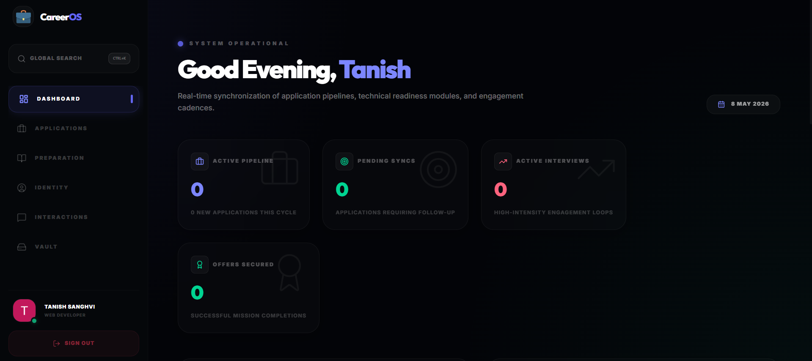
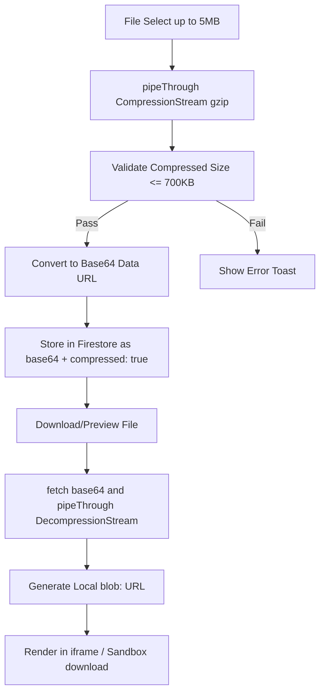

<div align="center">


# CareerOS

**Tactical Operating System for Professional Career Acquisition**

[](https://nextjs.org/)
[](https://firebase.google.com/)
[](https://tailwindcss.com/)
[](https://vitest.dev/)
[](docs/LICENSE)

CI is configured in `.github/workflows/ci.yml`.

[Installation Guide](docs/INSTALLATION.md) · [Contributing](docs/CONTRIBUTING.md) · [Live Demo](https://career-os-henna.vercel.app)



</div>

---

## What is CareerOS?

CareerOS is a full-stack, production-grade career management platform built for technical professionals. It replaces scattered spreadsheets and disconnected tools with a single, real-time command center — covering everything from job pipeline tracking and outreach CRM to technical interview preparation and secure document storage.

Built on **Next.js 16 App Router**, **Firebase Firestore**, and a custom **"Void-Indigo"** design system, it is deployed on Vercel and designed to handle real-world career workflows at scale.

---

## Table of Contents

- [Features](#features)
- [Tech Stack](#tech-stack)
- [Project Structure](#project-structure)
- [Getting Started](#getting-started)
- [Environment Variables](#environment-variables)
- [Available Scripts](#available-scripts)
- [Architecture](#architecture)
- [Firestore Collections](#firestore-collections)
- [Testing](#testing)
- [CI/CD Pipeline](#cicd-pipeline)
- [Design System](#design-system)
- [Contributing](#contributing)
- [License](#license)

---

## Features

### Infiltration Hub — Job Pipeline

- Interactive layout view toggle switcher (Grid List vs. Drag-and-Drop Kanban Board)
- Grid-based job application tracker with 8 pipeline stages: `Sourced → Shortlisted → Applied → Followed-up → OA → Interview → Offer → Rejected`
- Drag-and-drop Kanban board built with `@dnd-kit` featuring tactile pointer constraints and dynamic grab indicators
- Per-card quality gate checklist (resume mapping, outreach drafted, follow-up set)
- Star rating for excitement level per application
- Intelligent follow-up urgency detection (3-day and 10-day business day cadence)
- Real-time conversion funnel analytics (Sourced → Applied → Interview → Secured)
- One-click CSV export of the full pipeline

### Communication Hub — Outreach CRM

- Full contact log with name, role, company, platform, and status tracking
- Cadence engine: 17-day outreach cycle with visual progress bars and overdue alerts
- Batch select, bulk delete, and CSV export
- User-defined message template library + system-provided inspiration templates
- Responsive table (desktop) and card (mobile) views
- Email validation on contact forms

### Tactical Preparation — Interview Readiness

- **Stack Mastery**: Domain-specific proficiency sliders across Languages, Frontend, Backend, and Cloud
- **DSA Sprint Log**: Problem tracker with difficulty cycling (Easy / Medium / Hard) and completion toggle
- **Behavioral Intel (STAR)**: Structured Situation / Task / Action / Result narrative vault
- Dual progress rings showing overall DSA completion and average stack mastery

### Identity Partition — Professional Profile

- Inline-editable profile dossier (name, title, location, phone, mission statement)
- Technical arsenal manager with per-category skill add/remove
- Proof of Work project cards with GitHub and live URL deep-links
- Social node management (LinkedIn, GitHub, Portfolio)
- Floating save bar with unsaved-changes detection

### Document Vault — Secure Asset Storage

- Client-side browser-native compression (`CompressionStream('gzip')`) enabling secure Base64 direct-database storage for files up to **5MB** (compressed down to fit under Firestore's 1MB single-document limits)
- Asynchronous background decompression (`DecompressionStream('gzip')`) and blob-caching on download triggers and file previews
- Auto-category detection: Resume, Cover Letter, Credential
- Inline file renaming, starring, preview (integrated loading animations), and download
- Bulk select, bulk download, bulk delete
- Sort by date, name, or size; filter by category
- Storage usage meter with memory-safe object URL garbage collection

### Responsive Engineering (Viewport Scaling down to 300px)

- Mobile-first segmented tab switchers (full width on mobile, inline-fixed on desktop)
- Vertical-stacking responsive section headers to avoid action button squeeze/overflow
- Micro-calibrated grid structures and margins (switching dashboard stats to responsive CSS grid columns)
- Full-width mobile bottom drawer save controllers with auto-shift transitions for thumb-reach access

### Dashboard — Mission Command Center

- Real-time aggregated metrics: active pipeline, pending follow-ups, interviews, offers
- DSA progression ring and stack proficiency ring
- Engagement efficiency donut chart (outreach reply rate)
- Recent interactions feed
- Daily strategy task list (add, complete, delete tasks)
- Time-aware greeting and live date display

---

## Tech Stack

| Layer       | Technology                                                                                           | Version        |
| ----------- | ---------------------------------------------------------------------------------------------------- | -------------- |
| Framework   | [Next.js](https://nextjs.org/) App Router                                                            | 16.2.4         |
| UI Library  | [React](https://react.dev/)                                                                          | 19.2.5         |
| Styling     | [Tailwind CSS](https://tailwindcss.com/) v4                                                          | 4.2.4          |
| Database    | [Firebase Firestore](https://firebase.google.com/docs/firestore)                                     | 12.12.1        |
| Auth        | [Firebase Authentication](https://firebase.google.com/docs/auth)                                     | 12.12.1        |
| Animations  | [Framer Motion](https://www.framer.com/motion/)                                                      | 12.38.0        |
| Icons       | [Lucide React](https://lucide.dev/)                                                                  | 1.14.0         |
| Drag & Drop | [@dnd-kit](https://dndkit.com/)                                                                      | 6.3.1 / 10.0.0 |
| Utilities   | [clsx](https://github.com/lukeed/clsx) + [tailwind-merge](https://github.com/dcastil/tailwind-merge) | latest         |
| Testing     | [Vitest](https://vitest.dev/) + [React Testing Library](https://testing-library.com/)                | 3.2.4          |
| Linting     | [ESLint](https://eslint.org/) v9 (flat config)                                                       | 9.39.0         |
| Formatting  | [Prettier](https://prettier.io/) + prettier-plugin-tailwindcss                                       | 3.8.3          |
| Deployment  | [Vercel](https://vercel.com/)                                                                        | —              |

---

## Project Structure

```
careeros/
├── .github/
│   └── workflows/
│       └── ci.yml              # GitHub Actions: lint → format → test → build
├── assets/
│   ├── banner.png              # README banner image
│   └── image.png               # Additional asset
├── docs/
│   ├── GUIDE.md                # Strategic architecture guide
│   ├── INSTALLATION.md         # Full setup instructions
│   ├── CONTRIBUTING.md         # Contribution guidelines
│   ├── CODE_OF_CONDUCT.md      # Community standards
│   └── LICENSE                 # ISC License
├── public/
│   ├── logo.png                # App logo (used in PWA manifest + favicon)
│   └── robots.txt              # SEO crawler rules
├── src/
│   ├── app/                    # Next.js App Router pages
│   │   ├── layout.jsx          # Root layout: fonts, providers, shell
│   │   ├── page.jsx            # Dashboard (/)
│   │   ├── globals.css         # Tailwind v4 theme + custom utilities
│   │   ├── manifest.json       # PWA manifest
│   │   ├── sitemap.js          # Auto-generated XML sitemap
│   │   ├── not-found.js        # Global 404 page
│   │   ├── error.js            # Global error boundary
│   │   ├── loading.js          # Global loading state
│   │   ├── jobs/               # /jobs — Infiltration Hub
│   │   ├── comms/              # /comms — Communication CRM
│   │   ├── prep/               # /prep — Tactical Preparation
│   │   ├── identity/           # /identity — Identity Partition
│   │   └── vault/              # /vault — Document Vault
│   ├── components/
│   │   ├── auth/
│   │   │   ├── Auth.jsx        # Email/password + Google OAuth form
│   │   │   ├── AuthGate.jsx    # HOC: redirect unauthenticated users
│   │   │   └── ProtectedRoute.jsx  # Inline auth gate (shows Auth form)
│   │   ├── layout/
│   │   │   ├── Sidebar.jsx     # Desktop navigation + profile section
│   │   │   ├── Navbar.jsx      # Mobile navigation with slide-out menu
│   │   │   ├── CommandPalette.jsx  # Ctrl+K global search (jobs, vault, projects)
│   │   │   └── PageTransition.jsx  # Framer Motion route transition wrapper
│   │   ├── features/
│   │   │   ├── dashboard/
│   │   │   │   ├── StatCard.jsx        # Animated metric card
│   │   │   │   ├── ConversionFunnel.jsx # Pipeline funnel visualization
│   │   │   │   ├── SuccessAnalytics.jsx # Jobs analytics panel
│   │   │   │   └── ObjectiveList.jsx    # Daily task list
│   │   │   ├── jobs/
│   │   │   │   ├── JobCard.jsx         # Application card with quality gate
│   │   │   │   ├── JobForm.jsx         # Add/edit job modal form
│   │   │   │   ├── KanbanBoard.jsx     # dnd-kit drag-and-drop board
│   │   │   │   ├── KanbanColumn.jsx    # Sortable column container
│   │   │   │   └── AcquisitionSuccess.jsx  # Offer celebration modal
│   │   │   ├── comms/
│   │   │   │   ├── InteractionNode.jsx # Table row + mobile card (dual export)
│   │   │   │   ├── ContactForm.jsx     # Add/edit contact modal
│   │   │   │   ├── TemplateCard.jsx    # Message template display card
│   │   │   │   └── TemplateForm.jsx    # Create template modal
│   │   │   ├── identity/
│   │   │   │   ├── ProjectCard.jsx     # Proof-of-work project card
│   │   │   │   └── TechDomainCard.jsx  # Stack mastery domain card
│   │   │   ├── prep/
│   │   │   │   └── DSATaskRow.jsx      # DSA problem row with difficulty toggle
│   │   │   └── vault/
│   │   │       ├── FileCard.jsx        # Document card with rename/star/preview
│   │   │       └── FilePreview.jsx     # In-modal document previewer
│   │   └── ui/
│   │       ├── Badge.jsx           # Status/category badge (7 color variants)
│   │       ├── BrandIcons.jsx      # LinkedIn, GitHub, Gmail SVG icons
│   │       ├── Confetti.jsx        # Canvas confetti burst (offer celebration)
│   │       ├── LogoLoader.jsx      # Animated logo spinner
│   │       ├── ProgressRing.jsx    # SVG circular progress indicator
│   │       ├── SkeletonCard.jsx    # Loading skeleton (card, row, text variants)
│   │       ├── StarRating.jsx      # 5-star interactive rating
│   │       └── StarStoryCard.jsx   # STAR behavioral story editor
│   ├── context/
│   │   ├── AuthContext.jsx         # Firebase auth state + login/logout/signup
│   │   ├── DataContext.jsx         # Shared jobs, outreach, profile streams
│   │   ├── ToastContext.jsx        # Portal-based toast notifications (4 types)
│   │   ├── ModalContext.jsx        # Portal-based modal system (sm/md/lg sizes)
│   │   └── CommandPaletteContext.jsx  # Ctrl+K open/close state + input ref
│   ├── hooks/
│   │   ├── useDatabase.js          # useCollection + useUserDoc (Firestore CRUD)
│   │   └── useDebounce.js          # useDebounce + useDebouncedCallback
│   ├── lib/
│   │   └── firebase.js             # Firebase app init (HMR-safe, emulator support)
│   ├── utils/
│   │   ├── dateUtils.js            # formatBytes, addBusinessDays, getCadenceStatus, formatDate, getWeekNumber
│   │   └── fileUtils.js            # getFileIcon, detectCategory, VAULT_CATEGORIES, CATEGORY_STYLES
│   └── test/
│       ├── setup.js                # @testing-library/jest-dom setup
│       ├── JobCard.test.jsx        # JobCard render + interaction tests
│       ├── ProtectedRoute.test.js  # Auth gate state tests
│       ├── dateUtils.test.js       # Core date utility tests
│       ├── hooks/
│       │   └── useDebounce.test.js # useDebounce + useDebouncedCallback tests
│       ├── pages/
│       │   ├── Dashboard.test.jsx  # Dashboard page integration tests
│       │   └── Jobs.test.jsx       # Jobs page integration tests
│       └── utils/
│           └── dateUtils.test.js   # Extended date utility tests
├── .env.example                # Environment variable template
├── .firebaserc                 # Firebase project aliases (staging: careeros-59eca)
├── .gitignore                  # Ignores node_modules, .env.local, .next
├── .npmrc                      # audit=true, fund=false, save-exact=true
├── eslint.config.mjs           # ESLint v9 flat config (Next, React, Hooks, Prettier)
├── firebase.json               # Firestore rules + indexes config
├── firestore.indexes.json      # Composite indexes for all 10 collections
├── firestore.rules             # Owner-only security rules for all collections
├── jsconfig.json               # Path alias: @/* → ./src/*
├── next.config.mjs             # Image domains, security headers
├── package.json                # Dependencies + scripts
├── postcss.config.js           # @tailwindcss/postcss plugin
├── prettier.config.cjs         # Prettier: single quotes, 100 char width, LF
├── tailwind.config.js          # Content paths + theme extensions
└── vitest.config.mjs           # Vitest: jsdom, @/ alias, coverage via v8
```

---

## Getting Started

### Prerequisites

- **Node.js** 18.x or higher
- **npm** 9.x or higher
- A **Firebase** project with Firestore and Authentication enabled

### 1. Clone the repository

```bash
git clone https://github.com/<your-github-username>/careeros.git
cd careeros
```

### 2. Install dependencies

```bash
npm install
```

### 3. Configure environment variables

Copy the example file and fill in your Firebase credentials:

```bash
cp .env.example .env.local
```

```env
NEXT_PUBLIC_FIREBASE_API_KEY=your_api_key
NEXT_PUBLIC_FIREBASE_AUTH_DOMAIN=your_project.firebaseapp.com
NEXT_PUBLIC_FIREBASE_PROJECT_ID=your_project_id
NEXT_PUBLIC_FIREBASE_STORAGE_BUCKET=your_project.appspot.com
NEXT_PUBLIC_FIREBASE_MESSAGING_SENDER_ID=your_sender_id
NEXT_PUBLIC_FIREBASE_APP_ID=your_app_id
NEXT_PUBLIC_FIREBASE_MEASUREMENT_ID=your_measurement_id  # optional
```

### 4. Set up Firebase

1. Go to the [Firebase Console](https://console.firebase.google.com/) and create a project
2. Enable **Authentication** → Google sign-in provider
3. Enable **Cloud Firestore** and deploy the security rules:

```bash
npx firebase deploy
```

### 5. Start the development server

```bash
npm run dev
```

Open [http://localhost:3000](http://localhost:3000) in your browser.

---

## Environment Variables

| Variable                                   | Required | Description             |
| ------------------------------------------ | -------- | ----------------------- |
| `NEXT_PUBLIC_FIREBASE_API_KEY`             | ✅       | Firebase Web API key    |
| `NEXT_PUBLIC_FIREBASE_AUTH_DOMAIN`         | ✅       | Firebase Auth domain    |
| `NEXT_PUBLIC_FIREBASE_PROJECT_ID`          | ✅       | Firestore project ID    |
| `NEXT_PUBLIC_FIREBASE_STORAGE_BUCKET`      | ✅       | Firebase Storage bucket |
| `NEXT_PUBLIC_FIREBASE_MESSAGING_SENDER_ID` | ✅       | FCM sender ID           |
| `NEXT_PUBLIC_FIREBASE_APP_ID`              | ✅       | Firebase App ID         |

---

## Available Scripts

```bash
npm run dev           # Start Next.js development server
npm run build         # Create production build
npm run start         # Start production server
npm run lint          # Run ESLint on src/
npm run lint:fix      # Run ESLint with auto-fix
npm run format        # Format all files with Prettier
npm run format:check  # Check formatting without writing
npm run test          # Run all tests (single pass)
npm run test:watch    # Run tests in watch mode
npm run test:coverage # Run tests with v8 coverage report
npm run validate      # lint + test + build (full quality gate)
```

---

## Architecture

### Data Flow

```
Firebase Auth
     │
     ▼
AuthContext  ──────────────────────────────────────────────────────────┐
     │                                                                  │
     ▼                                                                  │
useDatabase (useCollection / useUserDoc)                               │
     │                                                                  │
     ├── DataContext (jobs, outreach, profile — shared streams)        │
     │        │                                                         │
     │        ▼                                                         │
     │   Dashboard / Sidebar / Navbar                                  │
     │                                                                  │
     └── Per-page hooks (techTopics, dsa, tasks, vault, projects...)   │
              │                                                         │
              ▼                                                         │
         Feature Pages ◄──── ModalContext / ToastContext ◄─────────────┘
```

### Context Providers (Root Layout)

Providers are nested in this order in `src/app/layout.jsx`:

```
AuthProvider
  └── ToastProvider
        └── ModalProvider
              └── CommandPaletteProvider
                    └── DataProvider
                          └── App Shell (Sidebar + PageTransition + Navbar + CommandPalette)
```

### Custom Hooks

| Hook                   | Location               | Purpose                                                         |
| ---------------------- | ---------------------- | --------------------------------------------------------------- |
| `useCollection`        | `hooks/useDatabase.js` | Real-time Firestore collection with CRUD (filtered by `userId`) |
| `useUserDoc`           | `hooks/useDatabase.js` | Real-time singleton user document (e.g. profile)                |
| `useDebounce`          | `hooks/useDebounce.js` | Debounced value (delays state update)                           |
| `useDebouncedCallback` | `hooks/useDebounce.js` | Debounced stable callback reference                             |

### Route Structure

| Route       | Page                    | Description                               |
| ----------- | ----------------------- | ----------------------------------------- |
| `/`         | `app/page.jsx`          | Dashboard — mission command center        |
| `/jobs`     | `app/jobs/page.jsx`     | Infiltration Hub — job pipeline           |
| `/comms`    | `app/comms/page.jsx`    | Communication CRM — outreach log          |
| `/prep`     | `app/prep/page.jsx`     | Tactical Preparation — DSA + STAR + Stack |
| `/identity` | `app/identity/page.jsx` | Identity Partition — profile + projects   |
| `/vault`    | `app/vault/page.jsx`    | Document Vault — secure file storage      |

Each route has its own `layout`, `loading`, and `error` files for granular loading and error states.

### Client-side Asset Compression Pipeline

To store documents directly in Firestore safely without hitting database limits or provisioning high-cost storage buckets, CareerOS runs an end-to-end gzip streaming compression engine inside the browser client:



---

## Firestore Collections

All collections enforce owner-only access via `userId` field matching `request.auth.uid`.

| Collection        | Description                 | Key Fields                                                              |
| ----------------- | --------------------------- | ----------------------------------------------------------------------- |
| `jobs`            | Job applications            | `company`, `role`, `status`, `appliedDate`, `excitement`, `qualityGate` |
| `outreach`        | CRM contacts                | `name`, `role`, `company`, `platform`, `status`, `action`, `starred`    |
| `profiles`        | User profile (doc ID = UID) | `name`, `title`, `location`, `stack`, `mission`, `linkedin`, `github`   |
| `projects`        | Portfolio projects          | `name`, `desc`, `tech[]`, `liveUrl`, `githubUrl`                        |
| `vault`           | Uploaded documents          | `name`, `type`, `size`, `content` (Base64), `category`, `starred`       |
| `dsa`             | DSA problems                | `title`, `completed`, `difficulty`                                      |
| `techTopics`      | Stack domains               | `topic`, `mastery` (0–100)                                              |
| `starStories`     | STAR narratives             | `title`, `situation`, `task_`, `action`, `result`                       |
| `tasks`           | Daily objectives            | `text`, `completed`, `priority`                                         |
| `customTemplates` | Message templates           | `title`, `body`                                                         |

Composite indexes are defined in `firestore.indexes.json` for all collections, ordered by `userId ASC + createdAt DESC`.

---

## Testing

Tests live in `src/test/` and use **Vitest** with **React Testing Library** and **jsdom**.

```bash
npm run test           # Run the full test suite
npm run test:coverage  # Generate coverage report
```

### Test Coverage

| File                        | What's Covered                                         |
| --------------------------- | ------------------------------------------------------ |
| `JobCard.test.jsx`          | Render, expand/collapse, delete confirmation           |
| `ProtectedRoute.test.js`    | Loading state, unauthenticated, authenticated          |
| `Dashboard.test.jsx`        | Title render, metrics display, stats grid              |
| `Jobs.test.jsx`             | Title, search filter, modal open, job cards            |
| `dateUtils.test.js`         | Business days, follow-up status, cadence               |
| `utils/dateUtils.test.js`   | formatBytes, getDaysDifference, formatDate, weekNumber |
| `hooks/useDebounce.test.js` | Value debounce, callback debounce                      |

### Mocking Strategy

- Firebase (`@/lib/firebase`) is mocked globally in page-level tests
- Context hooks (`useAuth`, `useData`, `useToast`, `useModal`) are mocked per test file
- `ProtectedRoute` is mocked in page tests to bypass auth
- `vi.useFakeTimers()` is used for time-sensitive date utility tests

---

## CI/CD Pipeline

GitHub Actions runs on every push and pull request to `main`:

```
1. Checkout code
2. Setup Node.js 20 with npm cache
3. npm ci
4. npm run lint
5. npm run format:check
6. npm run test:coverage
7. npm run build  (with Firebase env secrets)
```

Firebase environment variables are stored as GitHub repository secrets and injected during the build step.

---

## Design System

CareerOS uses a custom **"Void-Indigo"** design system built on Tailwind CSS v4.

### Color Palette

| Token      | Value                | Usage                               |
| ---------- | -------------------- | ----------------------------------- |
| Background | `#030408`            | App shell base                      |
| Panel      | `rgba(13,17,30,0.6)` | Card/panel surfaces                 |
| Primary    | `#6366f1`            | Actions, active states, indigo glow |
| Success    | `#10b981`            | Positive metrics, emerald pulse     |
| Warning    | `#f59e0b`            | Amber alerts, preparation module    |
| Danger     | `#ef4444`            | Errors, destructive actions         |
| Text       | `#f8fafc`            | Primary text                        |
| Muted      | `#64748b`            | Secondary text                      |

### Custom Utility Classes (defined in `globals.css`)

| Class             | Description                                                                             |
| ----------------- | --------------------------------------------------------------------------------------- |
| `.panel`          | Glassmorphic card: `backdrop-blur-2xl`, `bg-white/1.5`, `border-white/5`, `rounded-3xl` |
| `.btn-primary`    | Indigo filled button with glow shadow                                                   |
| `.btn-secondary`  | Subtle white/5 button                                                                   |
| `.input-field`    | Dark input with indigo focus ring                                                       |
| `.title-xl`       | Responsive hero heading (3xl → 5xl, font-black, font-outfit)                            |
| `.chip`           | Compact inline tag                                                                      |
| `.glass-card`     | Base glassmorphism card                                                                 |
| `.scrollbar-hide` | Cross-browser scrollbar suppression                                                     |
| `.animate-in`     | Slide-up entrance animation                                                             |
| `.shimmer-active` | Shimmer loading effect overlay                                                          |

### Typography

- **Body**: Inter (variable font, `--font-inter`)
- **Display/Headings**: Outfit (variable font, `--font-outfit`)
- Both loaded via `next/font/google` with `display: swap`

### Security Headers (next.config.mjs)

Applied to all routes (`/(.*)`):

```
X-Content-Type-Options: nosniff
X-Frame-Options: DENY
X-XSS-Protection: 1; mode=block
Referrer-Policy: strict-origin-when-cross-origin
Permissions-Policy: camera=(), microphone=(), geolocation=()
```

---

## Contributing

Contributions are welcome. Please read [CONTRIBUTING.md](docs/CONTRIBUTING.md) before opening a pull request.

**Quick summary:**

1. Fork the repo and create a feature branch (`feat/your-feature`)
2. Follow the existing code style (ESLint + Prettier will enforce it)
3. Write or update tests for your changes
4. Ensure `npm run validate` passes (lint + test + build)
5. Use [Conventional Commits](https://www.conventionalcommits.org/) for commit messages
6. Open a PR against `main` with a clear description

See [CODE_OF_CONDUCT.md](docs/CODE_OF_CONDUCT.md) for community standards.

---

## License

Released under the [ISC License](docs/LICENSE).

---

<div align="center">

_CareerOS — Built for professionals who treat their job search like a mission._

</div>
